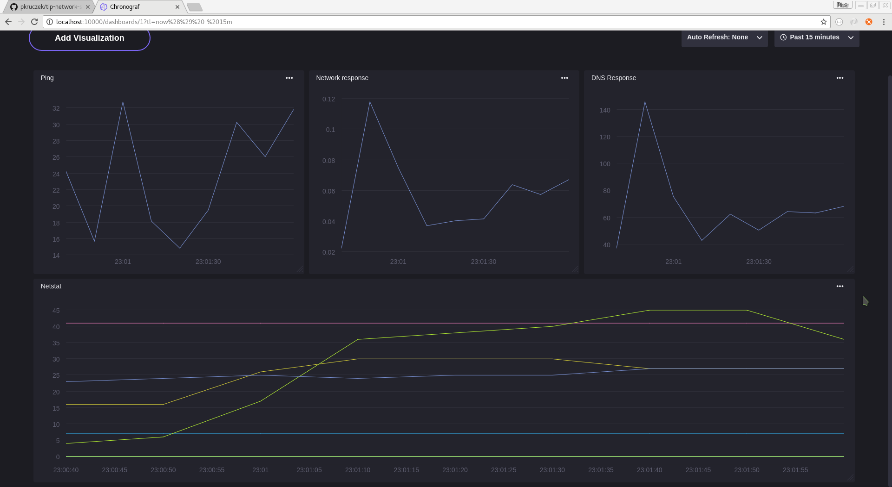

# Docker image collecting network stats - TIP Project

### Overview
This is a Docker image which allows to gather, visualize and monitor network data.
It contains following tools:
* **InfluxDB** - time series database which stores network data
* **Telegraf** - a tool which gathers data and pushes it to InfluxDB
* **Chronograf** - web application which provides the tools to visualize monitoring data
* **Kapacitor** - framework for processing, monitoring, and alerting on time series data  

### How to get Docker image?

#### Pull from Docker repository
```
docker pull pkruczek/tip-network-stats
```

#### Or build on your own

###### Clone Git repository

```
git clone https://github.com/pkruczek/tip-network-stats.git
```
###### Get into project directory
```
cd tip-network-stats
```
###### Build Docker image
```
docker build -t tip-network-stats .
```

### How to run Docker container?

###### Run Docker container
```
docker run --net=host -p 10000:10000 tip-network-stats
```
Explanation:
* `--net=host` - this flag set host's network as container network. It's required because docker creates dedicated network for containers.
* `-p 10000:10000` - bind container's port 10000 to host's 10000. It allows to access Chronograf dashboards on [http://localhost:10000][chronograf]

#### Access [Chronograf][chronograf]
Chronograf is available on port 10000

###### Custom Chronograf dashboard
This image contains prepared simple Chronograf dashboard.



If you want to build a new dashboard
or use custom one, you can replace Chronograf db using following command:
```
docker run --net=host -v $PWD/chronograf.db:/var/lib/chronograf/chronograf.db -p 10000:10000 tip-network-stats
```
Any new view created will be saved in mounted file `chronograf.db` in current directory.
When you want to run container with that custom file, you should run the same command (in the
same directory)


#### Access [InfluxDB Admin][influx-admin]
InfluxDB Admin is available on port 8083 (run with flag `-p 8083:8083`)

###### Seting up Kapacitor
example kapacitor alert is prepared in pingAlert.tick file it check average ping to 8.8.8.8 host in 10 s periods and check if is not higher then 300 ms INFO , 500 ms WARN , 800 ms ERROR and save alerts to /tmp/ping_log.txt . Alerts can be also send on email or slack chanel etc.
example comand to send email just add it at the end of pingAlert.tick file or insted  .log('/tmp/ping_log.txt') 
```
.email('oncall@example.com')
```
to add more recivers type after .email()
```
.to('support@example.com')
```

more info about how to write tick scripts can be find 
https://docs.influxdata.com/kapacitor/v1.2/

##To add new script 
you need to create proper tick script file in kapacitor folder then add 
```
kapacitor define {ALERT NAME} \
    -type {ALERT TYPE batch/stream} \
    -tick /var/lib/kapacitor/{FILE NAME} \
    -dbrp telegraf.autogen

kapacitor enable {ALERT NAME}
```
to runKapacitorAlerts.sh file in root dir 

 container need to be rebuild after meking change in files in repository dir.
 to make experiments just Log into the container and have fun.
 
 all kapacitor propertis and configuration can be changed in kapacitor/kapacitor.conf file
 for example to send email in alert can be necesery to add smtp configuration.
 
 more infocan be find 
https://docs.influxdata.com/kapacitor/v1.2/


### Hints
* Run image as named container
```
docker run --rm --net=host -p 8083:8083 -p 8086:8086 -p 9092:9092 -p 10000:10000 --name network-stats tip-network-stats
```

* Log into the container
```
docker exec -ti network-stats /bin/bash
```

* Stop container
```
docker stop network-stats
```

[chronograf]: http://localhost:10000
[Influx-admin]: http://localhost:8083
